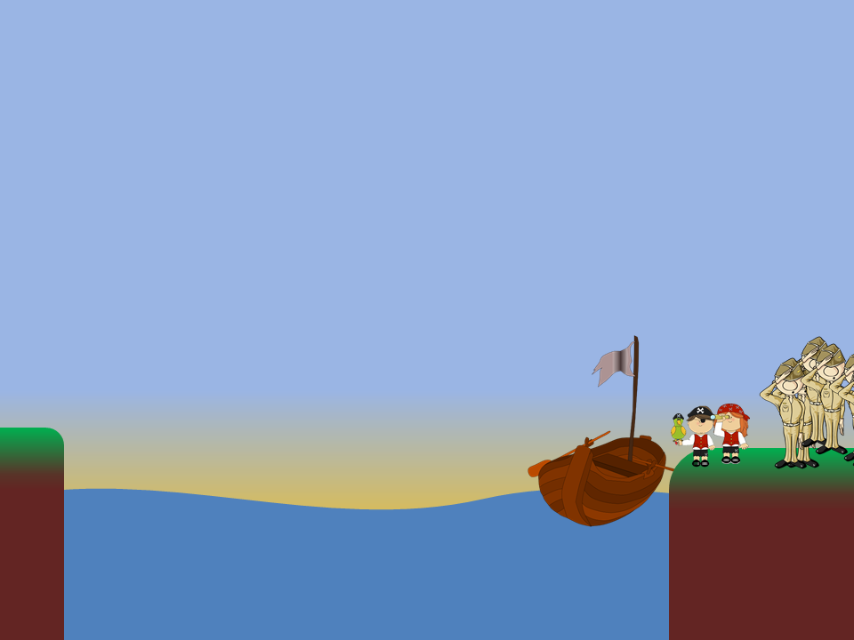

#Computational Thinking 


##Instructions
For this computational thinking challenge you should attempt to find a answer to problem set below. The answer to the problem is only part of your response, ***how*** you found the answer is what matters.

Once you can explain the solution you might try to write a computer program to simulate or model the solution. It might even generalise the problem and provide solutions for ***similar*** problems.

##Grading
|Grade|What must I do?|
|-----|---------------|
|D|I will be able to provide an answer to the problem.|
|C|I will be able to provide an answer to the problem, including an explanation of the algorithm / process.|
|B|I will be able to provide a clear explanation of the algorithm I developed to solve to problem.|
|A/A*|I have been able to demonstrate my understanding of the solution to this problem and represented the algorithm using a computer program.|

##The Problem - Ferrying Soliders
####A detachment of **25** soliders need to cross a deep wide river, with no bridge in sight. They spot two boys playing around in a row boat near the shore. They notice two children playing in a rowboat by the shore.

####The boat is so tiny, however, that it can only hold the two children *or* one of the soliders. How can the soliders get across the river and leave they children in joint posession of the boat? How many times does the boat need to pass from shore to shore in your solution?

###Rules:
- All 25 soliders must end up on the other side of the river.
- The boat can carry one child by themselves, both children or a single solider.
- At the end both children must be with the boat on either shore.

####How many trips from shore to shore must the boat take?
```
answer here
```
####Explain you algorithm here:
```
answer here
```

##Extension
Can you represent the algorithm for this problem using a computer program (any language)?
For text based programs you
