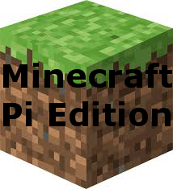
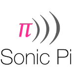

#Year 10 - Computer Science
##Summer Home Learning Takeaway. 
---

###Introduction###
Rather than have lots of smaller, regularly set pieces of homework, this term you will have all your homework set at the beginning and you must choose which ones you will complete.
- You must choose to complete 4 of the tasks below.
- You can complete your solution either on your pi or a PC.
- You complete code/answer must be handed in on github.
 
###Getting Started###
1. To begin with you should fork this repository to your own github account. 
2. Each Home Learning Activity is in it's own folder, read the instructions carefully.
3. Each time you commit a version of your code Github, add a **dated** comment to describe your changes.
4. Once an activity is complete you should submit a pull request with a comment about which task is ready for marking.
5. Don't leave the tasks until the last minute!

| Basic | Medium | Challenge |
|-------|--------|-----------|
|    |    |        |
|    |     |        |

